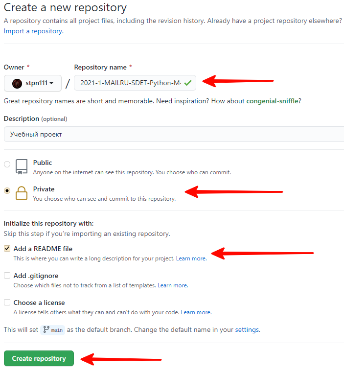
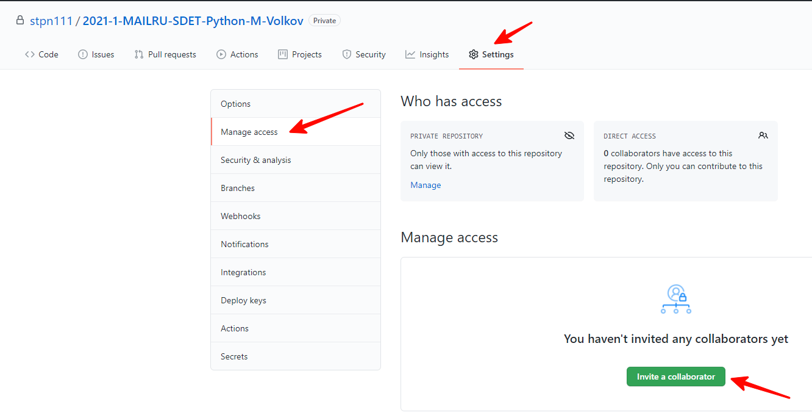
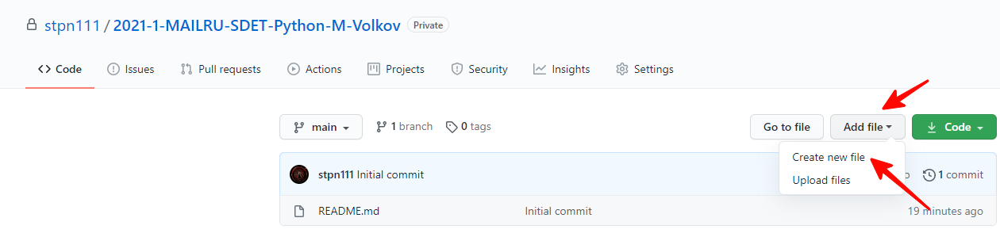
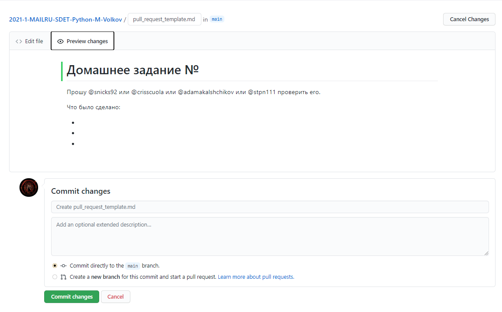
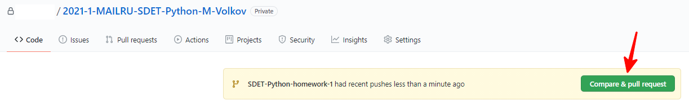
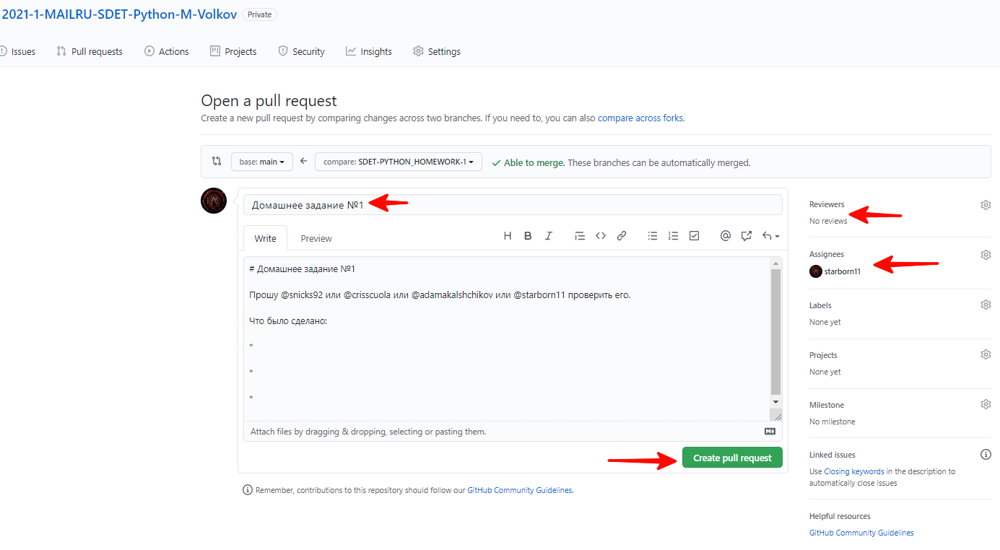

# Домашние задания курса "Автоматизированное тестирование"

### Инструкция по рабочему процессу с ДЗ

### 1. Создаем репозиторий
* Создаем новый репозиторий на [GitHub](https://github.com/new) или нажимаем на кнопку New в списке репозиториев:


### 2. Настраиваем репозиторий
* Создаем имя репозитория по следующему шаблону:

`YYYY-HALF_YEAR-MAILRU-SDET-Python-N-LAST_NAME`, где:

`YYYY` - год

`HALF_YEAR` - половина года, т.е. `1`, если сейчас `янв-июн`, или `2`, если `июл-дек`.

`N` - первая буква имени, `LAST_NAME` - фамилия.

Например, `2021-1-MAILRU-SDET-Python-I-Kirillov`.

Пожалуйста, проверьте дважды правильность имени вашего репозитория, это облегчит работу по проверке и оценке ваших работ.

* Обязательно выберите тип репозитория - **Private**.

Пример описанных настроек представлен на изображении ниже: 
  


* После окончания курса все репозитории можно будет вернуть в Public-режим и предоставлять на них ссылку в резюме при необходимости.

* Мы крайне рекомендуем после создания репозитория добавить в его **корень** файл **.gitignore**. Это позволит автоматически не добавлять в репозиторий временные файлы, создаваемые IDE или pytest'ом в папке проекта.
В корне репозитория представлен пример содержимого подобного файла, вы можете добавить этот файл в свой репозиторий.
  
### 3. Добавляем преподавателей в коллабораторы
 * Заходим в настройки репозитория (/settings/access).
 * Добавляем `snicks92`, `crisscuola`, `adamakalshchikov` и `stpn111` в collaborators.

 Нам придут приглашения, перед сдачей ДЗ нужно будет дождаться, пока мы их примем. Если инвайт не был принят спустя неделю, вы можете написать об этом преподавателю в Telegram.

Пример представлен на рисунке ниже:



### 4. Создаем шаблон для Pull Request
* Создаем файл с именем `pull_request_template.md` в корне проекта.
* Содержимое должно быть следующим:
```md
# Домашнее задание №

Прошу @snicks92 или @crisscuola или @adamakalshchikov или @stpn111 проверить его.

Что было сделано:

*

*

*

```

Это шаблон для ваших `PR (Pull Request)`, в котором есть упоминания всех преподавателей (для получения уведомлений). Сам файл при сдаче ДЗ редактировать не нужно. Вместо этого, при создании `PR` нужно в `GitHub` коротко описать проделанную работу.





### 5. Сдаем ДЗ на проверку
* Создаем новую ветку в формате
`SDET-Python-homework-N`, где:
`N` - номер домашнего задания.
* После выполнения домашнего задания, создаем пулл-реквест в ветку `main`.
  
* Добавляем `snicks92`, `crisscuola`, `adamakalshchikov` и `stpn111` в поля `reviewers` и `assignee`.
* В теме **обязательно** пишем номер ДЗ, в описании опционально пишем то, что сделано.
* Нажимаем на кнопку `Create pull request`. Создастся Pull Request, ссылку на который вы должны отправить в качестве ответа на домашнее задание через портал `https://education.mail.ru/`.
Ссылку на PR можно взять в адресной строке браузера, например `https://github.com/username/2021-1-MAILRU-SDET-Python-V-Pupkin/pull/1`



* После создания PR вам необходимо зайти на портал [education.mail.ru](https://education.mail.ru/), нажать на иконку своего профиля (в правом верхнем углу), после этого откроется личный кабинет.
* Чтобы увидеть задания, которые нужно сдать, нажмите на вкладку Успеваемость. У вас откроется список домашних заданий:


* Подробное описание заданий представлено в репозитории курса на [GitHub](https://github.com/snicks92/education-mail-qa-python). На портале же вы можете видеть все задания, которые нужно будет выполнить и дедлайн по ним, максимальное количество баллов и сможете отправить решение на проверку, нажав на нужное задание. На открывшейся странице будет кнопка "Отправить решение".
* Отправляя решение на проверку, вы можете написать просто текст, например, “Задание выполнил, все загрузил в GitHub” и обязательно оставить ```ссылку на PR```.
* В поле "Преподаватели" выберете всех преподавателей курса: ```Илья Кириллов, Константин Ермаков, Александр Дамакальщиков, Волков Михаил```.

### 6. Ожидаем проверки и вносим правки
 * С момента создания пулл-реквеста в него **запрещается** (!) вносить изменения, пока его не проверит преподаватель.
 Внесение изменений после создания пулл-реквеста и до момента комментирования преподавателем автоматически уменьшает итоговый балл на 30%.
 * Если все выполнено корректно - преподаватель апрувит PR и выполняется мерж.
 * Если есть недочеты - будут оставлены замечания, которые надо будет быстро исправить и запушить в текущий PR. Мы их увидим и пересоздавать PR не нужно.
 * После исправления всех недочетов в PR необходимо оставить комментарий "Исправлено".

___

### 7. Правила сдачи ДЗ
* Для всех ДЗ один репозиторий.
* В одном PR сдается только **одно** ДЗ.
* Каждое ДЗ делается в отдельной ветке и папке, чтобы избежать возможных конфликтов при мерже.
* Каждая ветка, из которой делается PR, должна быть синхронизирована с `main`.


### 8. Критерии оценки ДЗ
* Для того, чтобы успешно сдать домашнее задание - нужно вовремя создать PR (неделя с момента выдачи домашки).
* Срок сдачи каждого задания - 1 неделя с момента его выдачи на лекции. Например, если задание было выдано в среду, то срок сдачи - до 23:59 среды следующей недели.
* Максимальной оценкой оценивается решение, которое было выполнено правильно с первого раза согласно критериям проверки.
* Если были допущены сильные недочеты, то баллы снижаются в зависимости от степени замечаний на усмотрение преподавателя
* Максимальное количество попыток сдачи ДЗ - 3 раза. Однако, дополнять домашнее задание теми частями, которых не было в изначальном PR - нельзя,
  допустимы только исправления ошибок, которые указаны преподавателями.
* Если Вы сдаете ДЗ после недельного дедлайна или не сдаете вообще – ДЗ автоматически оценивается в 0 баллов и более не принимается. Исключения конечно же есть – это невозможность сдать ДЗ по строго уважительной причине, например болезни с предоставлением справки (в период короновируса это в целом довольно актуально) или вынужденном отъезде куда-либо.
* Проверяться будет все, как степень выполнения ДЗ согласно ТЗ, так и кодовая база (то есть как вы реализовали ту или иную задачу). Поэтому стараемся избавляться от неэффективных и чрезмерно перегруженных конструкций, копипаст и т.д.
* Отдельно про git, этот момент тоже будет проверяться, а именно – наличие лишних файлов в ПР, кривая история (без использования rebase, например), неинформативные коммиты и т.д.
